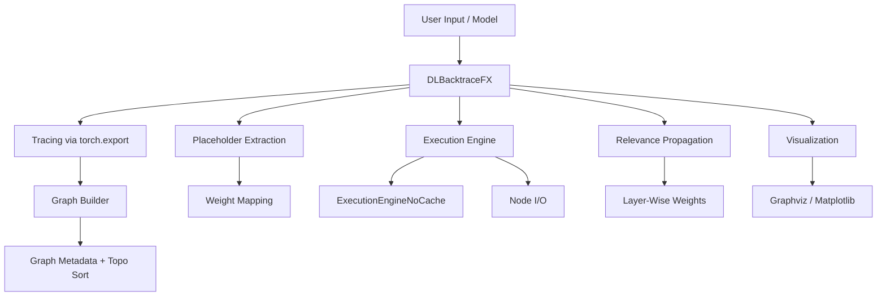

# 🧠 DL-Backtrace

**DL-Backtrace** is a powerful, explainable AI toolkit that enables layer-level tracing, execution visualization, and relevance attribution across PyTorch models. It leverages **graph tracing**, supports both **disk-based and memory-efficient** execution, and provides deep insight into the decision process of neural networks.

> Built for interpretability, extensibility, and integration into research & production pipelines.

---

## 🚀 Key Features

- 🔍 **Model Tracing** — Capture detailed graph metadata from PyTorch models.
- 💾 **In-Memory Execution** — Fast, memory-efficient execution via `ExecutionEngineNoCache`.
- 📈 **Graph Visualization** — Visualize the full forward graph or relevance-weighted graphs.
- 🧩 **ATen Operation Support** — Supports 100+ traced operations including conv, norm, reshape, attention, masking, etc.
- 🧠 **Layer-wise XAI** — Interpret how much each part of the model contributes to predictions.

---

## 🏗️ System Architecture



---

## 📦 Installation

```bash
git clone https://github.com/<your-org>/dl-backtracefx.git
cd dl-backtracefx
pip install -r requirements.txt
```

Requirements:
- `torch`
- `networkx`
- `matplotlib`
- `graphviz`
- `joblib`
- `zstandard`
- `numpy`

---

## ✨ Quick Start

```python
from dlbacktrace import DLBacktraceFX
import torchvision.models as models
import torch

# Load model and dummy input
model = models.resnet18(pretrained=False)
dummy_input = torch.randn(1, 3, 224, 224)

# Initialize tracer
dbg = DLBacktraceFX(model, (dummy_input,))

# Run forward pass
dbg.predict(dummy_input)

# Evaluate relevance
dbg.evaluation()

# Visualizations
dbg.visualize()  # Save full graph
dbg.visualize_dlbacktrace(top_k=15)  # Save relevance graph
```

---

## 🧠 How It Works

- **Tracing:** Uses `torch.export` to export a FX-style graph.
- **Graph Construction:** Extracts nodes, types, and hyperparams into a DAG via NetworkX.
- **Execution:** Each node is replayed, supporting standard ATen ops (e.g., `conv2d`, `relu`, `matmul`).
- **Relevance Propagation:** Reverses the graph and distributes output gradients back layer-by-layer.
- **Visualization:** Saves `.png` and `.svg` graphs with structure and scores.

---

## 🛠 Project Structure

```
dl_backtrace/
├── dlbacktrace.py                # Entry point
├── aten_operations.py            # Supported ATen operations
├── config.py                     # Hyperparameter and default tables
├────core/
├──── execution_engine.py           # Disk-cached execution engine
├──── execution_engine_noncache.py  # RAM-only execution engine
├──── graph_builder.py              # Builds graph and topology
├──── relevance_propagation.py      # LRP implementation
├──── trace_utils.py                # Placeholder and weight mapping
├──── visualization.py              # Graph rendering
├──── io_utils.py                   # Tensor/Numpy conversion utilities
```

---

## 📊 Example Output

TODO
---

## 📌 Notes

- ✅ Compatible with static and dynamic shapes.
- ✅ Handles symbolic dimensions via `torch.export`.
- ⚠️ Experimental: Multi-input models, custom ops.

---

## 📄 License

MIT © AryaXAI

---

## 🤝 Contributing

1. Fork this repo
2. Create your feature branch (`git checkout -b feature/xyz`)
3. Commit your changes (`git commit -am 'add new feature'`)
4. Push to the branch (`git push origin feature/xyz`)
5. Create a pull request 🎉
