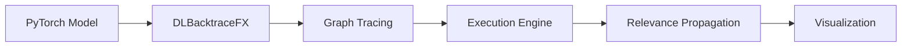

# PyTorch Backend Overview

DL-Backtrace provides comprehensive support for PyTorch models through the **DLBacktraceFX** API.

---

## Architecture

The PyTorch backend is built on several key components:



### Components

1. **DLBacktraceFX**: Main entry point for PyTorch models
2. **Graph Builder**: Traces computational graph using `torch.export`
3. **Execution Engine**: Executes operations and tracks activations
4. **Relevance Propagation**: Calculates layer-wise relevance
5. **Visualization**: Generates graph visualizations

---

## Supported Models

### Vision Models

- **CNNs**: ResNet, VGG, DenseNet, EfficientNet, MobileNet
- **Vision Transformers**: ViT, DeiT, Swin
- **Detection Models**: Custom detection architectures
- **Segmentation Models**: U-Net style architectures

### NLP Models

- **BERT Family**: BERT, RoBERTa, DistilBERT, ALBERT
- **GPT Family**: GPT-2, GPT-Neo
- **LLaMA**: LLaMA-3.2 (1B, 3B, 8B)
- **Custom Transformers**: Any transformer-based architecture

### Custom Models

Any PyTorch `nn.Module` that uses supported operations.

---

## Key Features

### 1. Dynamic Graph Tracing

Uses PyTorch's `torch.export` for robust graph capture:

```python
dlb = DLBacktraceFX(
    model=model,
    input_for_graph=(dummy_input,)
)
```

### 2. 100+ Supported Operations

Comprehensive ATen operation support:
- Linear layers, convolutions
- Pooling operations
- Activation functions
- Attention mechanisms
- Tensor manipulations
- And more...

### 3. Execution Engines

**ExecutionEngineNoCache** (Recommended):
- In-memory execution
- Memory efficient
- No disk I/O

### 4. Device Support

Seamless CPU and GPU support:
- Automatic device detection
- Mixed precision handling
- CUDA acceleration

---

## Quick Example

```python
import torch
import torchvision.models as models
from dl_backtrace.pytorch_backtrace import DLBacktraceFX

# Load model
model = models.resnet18(pretrained=True)
model.eval()

# Initialize DL-Backtrace
dummy_input = torch.randn(1, 3, 224, 224)
dlb = DLBacktraceFX(
    model=model,
    input_for_graph=(dummy_input,),
    layer_implementation="pytorch"
)

# Run analysis
test_input = torch.randn(1, 3, 224, 224)
node_io = dlb.predict(test_input)
relevance = dlb.evaluation(
    mode="default",
    multiplier=100.0,
    task="multi-class classification"
)

# Visualize
dlb.visualize()
```

---

## Next Steps

- [DLBacktraceFX API](dlbacktracefx.md) - Detailed API reference
- [Execution Engines](execution-engines.md) - Understanding execution
- [Supported Operations](operations.md) - Full operation list
- [Model Tracing](tracing.md) - Graph tracing details


